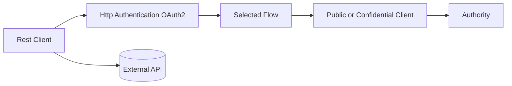
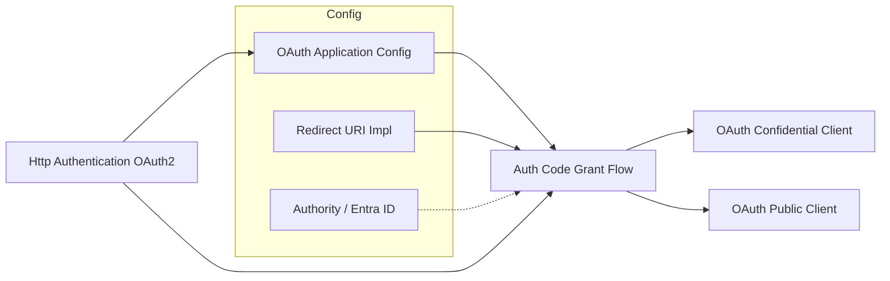
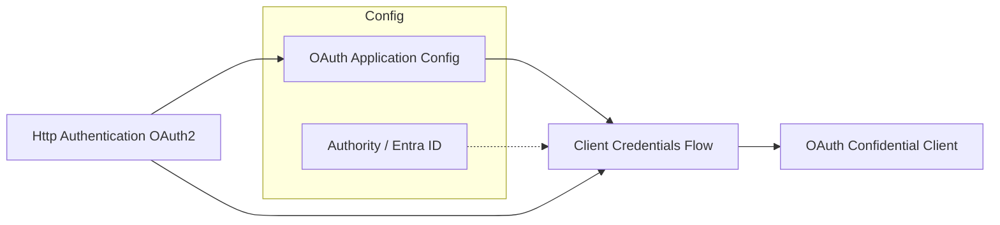
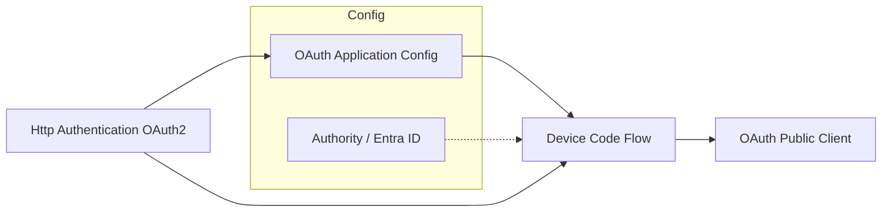
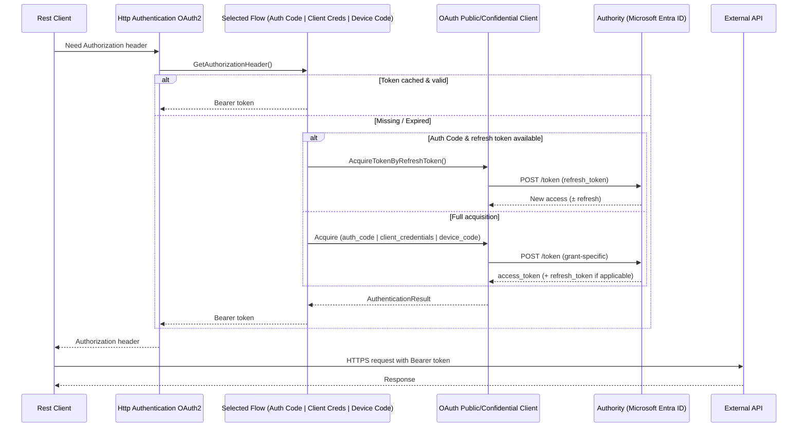
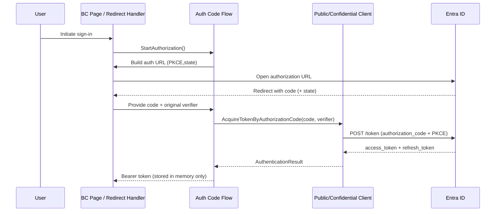
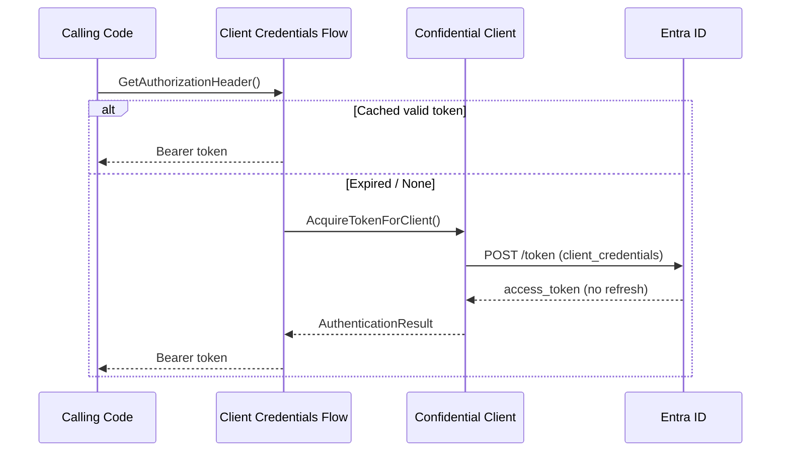
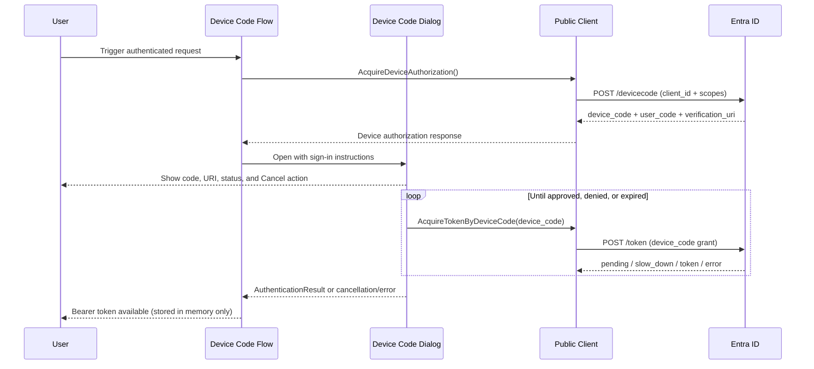
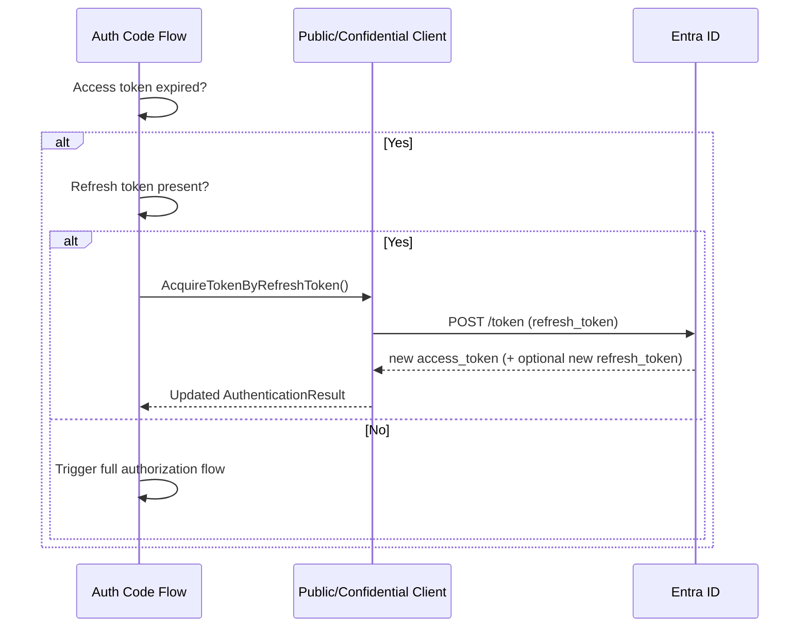

## Architecture

High-level overview of how the module composes OAuth 2.0 functionality for outbound REST calls in Business Central.

### Component Summary
- OAuth Application Config: Stores client id, optional secret or certificate, redirect URI type, scopes.
- Microsoft Entra App Registration: Optional reusable storage for richer app-registration metadata, secrets, and certificates.
- OAuth Confidential Client: Performs confidential token / refresh HTTP requests and appends a secret or signed client assertion.
- OAuth Public Client: Performs public token / refresh HTTP requests, including Authorization Code with PKCE and Device Code, without sending a client secret or certificate assertion.
- Authorization Flows: Authorization Code Grant, Client Credentials, and Device Code orchestrate token lifecycle.
- Redirect URI Implementations: Built‑in page redirect or custom control add-in.
- Authority (e.g. Microsoft Entra ID): Supplies discovery metadata (authorization, device authorization, token endpoints).
- Http Authentication OAuth2: Facade consumed by the Rest Client; delegates to chosen flow to obtain bearer header.
- Rest Client: Issues outbound HTTP calls injecting the Authorization header provided by Http Authentication OAuth2.
- Rest Client OAuth Endpoints: Optional app that maps generic endpoint records to the core OAuth objects. It is not required for apps that already own endpoint or domain-specific API setup.

### App Split
- `Rest Client OAuth` is the core app. It contains OAuth application configuration, OAuth clients, flows, authorities, redirect handling, and Microsoft Entra app-registration storage.
- `Rest Client OAuth Endpoints` is an optional endpoint app. It contains generic HTTP endpoint tables, pages, and factories that adapt endpoint records to the core app.
- Domain-specific apps should depend on the core app directly when their own setup already models customers, tenants, applications, or API base URLs.

---
### Component Diagrams

#### Part 1: Injection into Rest Client & Outbound Call Path
A minimalist structural view focused on how the Rest Client obtains an Authorization header and calls the external API.

Notes:
- Configuration objects and redirect handling are omitted here (details follow in Parts 1a/1b).
- Only one concrete flow instance backs `Selected Flow` at runtime (Auth Code, Client Credentials, or Device Code).
- The selected public or confidential token client performs HTTP token/refresh requests to the Authority.
- Rest Client proceeds to call the external API after `HA` returns a bearer token.

#### Part 1a: Detail – Composition (Authorization Code Grant Flow)

#### Part 1b: Detail – Composition (Client Credentials Flow)

#### Part 1c: Detail – Composition (Device Code Flow)

Notes (for 1a/1b/1c details):
- Dotted links from Authority indicate metadata (token endpoints) used by the flow; the selected token client performs HTTP requests later to the authority endpoints.
- Redirect URI implementation (built-in or custom control add-in) is only part of Authorization Code flow.
- OAuth Confidential Client manages credentialed token and refresh exchanges. OAuth Public Client manages Authorization Code with PKCE, Device Code, and public refresh exchanges without client secrets or certificate assertions.

#### Part 2: Runtime Usage & Token Retrieval
Illustrates how a REST call triggers token retrieval or refresh.

Notes:
- Only the selected token client sends HTTP calls to the Authority.
- Authorization Code and Device Code flows prefer refresh over initiating a new browser/device interaction.
- Client Credentials flow never has a refresh token; it reacquires a new token on expiry.

---
### Sequence: Authorization Code Grant (High-Level)

### Sequence: Client Credentials Flow

### Sequence: Device Code Flow

### Sequence: Refresh (Authorization Code Flow)

Authorization Code flow uses OAuth Public Client or OAuth Confidential Client according to the endpoint's OAuth Client Type setting, not by discovering whether the app registration currently has credentials. Device Code flow follows the same in-memory refresh preference, but always uses OAuth Public Client for the refresh-token request without a client secret or certificate assertion.

### Advanced Redirect URI
The advanced redirect implementation uses a control add-in to encapsulate browser interaction and can enable an SSO-like experience (reuse existing session, possibly suppressing interactive prompts). See [Advanced Redirect URI](AdvancedRedirectURI.md).

---
### Key Design Choices
- In-memory token storage: tokens tied to object lifetime; no persistent cache.
- PKCE + state enforced for Authorization Code flow to mitigate authorization-code interception and CSRF attacks.
- Scope offline_access auto-added for Authorization Code and Device Code flows to enable refresh token issuance.
- Authorization Code flow supports public-client and confidential-client token exchange. Endpoint configuration determines which token client is used.
- Certificate support allows JWT client assertions (reduces secret distribution) in confidential flows.
- Device Code flow is public-client only and never sends secret/certificate credentials. It is retained as an advanced/fallback flow, not as the preferred Business Central interactive path.
- Setup automation should use this module's own public setup application with Authorization Code + PKCE for Microsoft Graph bootstrap operations. It must not reuse another product's client id, such as Azure CLI, as a shortcut.

### Extensibility Notes
- Additional authorities can implement the authority interface to supply endpoints and additional properties.
- New flows could plug in provided they delegate final token exchange to OAuth Public Client or OAuth Confidential Client as appropriate.

For implementation details see: `Flows.md`, `Extensibility.md`, and `SecurityConsiderations.md`.
