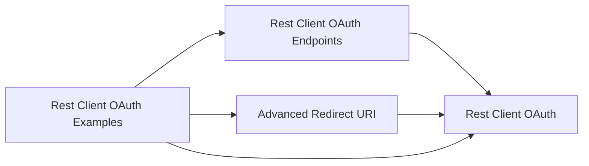

# Redesign Notes

The redesign separates reusable OAuth behavior from optional setup UI and example code. The goal is to let production extensions depend on the smallest useful app.

## Before

The original core app included OAuth flow objects and generic endpoint configuration together. That made endpoint records available by default, but it also meant every consumer took endpoint tables, pages, and factories even when their app already had a domain-specific setup model.

## After

The solution now has four app boundaries:

| App | Object range | Responsibility |
|-----|--------------|----------------|
| `Rest Client OAuth` | `50300..50349` | Core OAuth application config, authorities, token clients, flows, redirect contracts, and Entra app registration storage. |
| `Rest Client OAuth Endpoints` | `50350..50399` | Optional generic endpoint records, pages, and factories. |
| `Advanced Redirect URI` | `50400..50409` | Optional redirect URI implementation through a control add-in and hosted landing page. |
| `Rest Client OAuth Examples` | `50500..50549` | Demonstration pages, connectors, and sample Business Central API data tables. |

## Dependency Direction

The core app has no dependency on the optional companion apps. This keeps direct core consumers free from endpoint setup and advanced redirect assets.

## What Moved

- Generic HTTP endpoint tables moved to the endpoint app.
- Endpoint pages and endpoint authentication factories moved to the endpoint app.
- Endpoint-specific OAuth configuration documentation moved to endpoint docs.
- Advanced redirect implementation documentation moved to the advanced redirect app docs.
- Runnable sample documentation moved to the examples app docs.

## What Stayed In Core

- OAuth application configuration.
- Public and confidential token clients.
- Authorization Code, Client Credentials, and Device Code flows.
- Built-in redirect URI implementation and redirect URI interface.
- Microsoft Entra ID authority and app-registration storage.
- Security, flow, and extensibility guidance for direct AL consumers.

## Consumer Guidance

Use only `Rest Client OAuth` when your app owns its setup model. Use `Rest Client OAuth Endpoints` when you want reusable generic endpoint setup. Use `Advanced Redirect URI` only when the built-in redirect UX is not enough. Use `Rest Client OAuth Examples` only as reference or sample code, not as a production dependency.