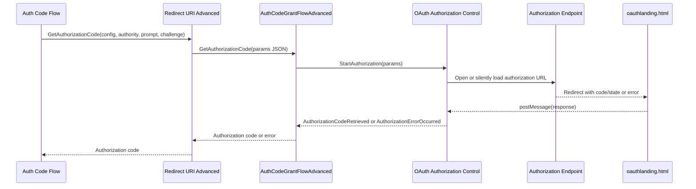

# Architecture

The advanced redirect app plugs into the core redirect URI interface. It does not implement token exchange; it only obtains the authorization code and returns it to `Codeunit 50305 "Auth. Code Grant Flow KFM"` in the core app.

## Object Model

| Object | Role |
| --- | --- |
| `EnumExtension 50400 "Redirect URI Advanced KFM"` | Adds the `Advanced KFM` redirect type. |
| `Codeunit 50400 "Redirect URI Advanced KFM"` | Implements `Interface "Redirect URI KFM"`. |
| `Page 50400 AuthCodeGrantFlowAdvancedKFM` | Modal page that hosts the control add-in. |
| `ControlAddIn "OAuth Authorization Control KFM"` | Starts browser authorization and passes results back to AL. |
| `oauthlanding.html` | Hosted landing page that posts the OAuth response back to the opener or parent window. |

## Flow

## Default Redirect URI

`Codeunit 50400 "Redirect URI Advanced KFM"` currently returns `https://msdyn365bc.z6.web.core.windows.net/oauthlanding.html` as the default redirect URI. The hosted page must contain logic equivalent to `src/ControlAddin/oauthlanding.html`.

## Parameter Passing

The redirect codeunit sends JSON to the control add-in with:

- authorization endpoint
- redirect URI
- PKCE code challenge
- code challenge method
- optional prompt value

The JavaScript builds the final authorization URL, adds state, and validates returned state before notifying AL.
