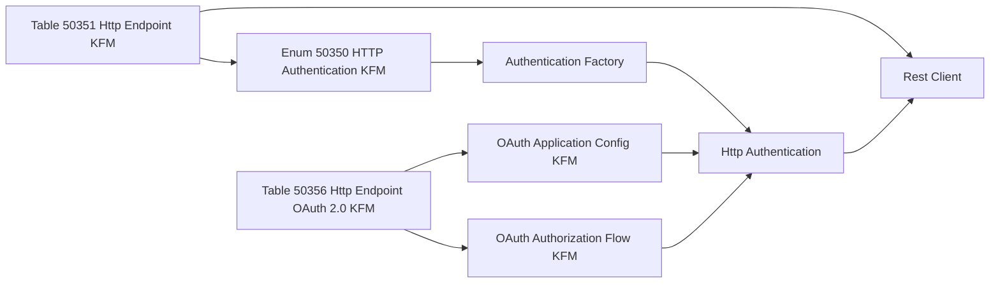

# Architecture

`Rest Client OAuth Endpoints` is an optional adapter layer. It stores generic endpoint configuration and maps those records to the core OAuth objects from `Rest Client OAuth`.

## Responsibilities

- Store reusable HTTP endpoint setup.
- Provide Business Central pages for endpoint setup.
- Create anonymous, Basic, or OAuth 2.0 authentication implementations from endpoint records.
- Initialize `Codeunit "Rest Client"` with endpoint authentication and base URL.

The app does not own OAuth token clients, OAuth flows, authorities, redirect handling, or Microsoft Entra app-registration storage. Those remain in the core app.

## Main Objects

| Object | Role |
| --- | --- |
| `Enum 50350 "HTTP Authentication KFM"` | Selects the endpoint authentication strategy and maps enum values to factory implementations. |
| `Table 50351 "Http Endpoint KFM"` | Endpoint header with code, description, base URL, and authentication type. |
| `Page 50357 "Http Endpoint Card KFM"` | Endpoint setup card. |
| `Page 50360 "Http Endpoint List KFM"` | Endpoint list. |
| `Table 50355 "Http Endpoint Basic Auth. KFM"` | Basic-auth settings. |
| `Page 50358 HttpEndpointBasicAuthSubfrmKFM` | Basic-auth setup subpage. |
| `Table 50356 "Http Endpoint OAuth 2.0 KFM"` | OAuth endpoint configuration. |
| `Table 50357 "Http Endpoint OAuth Scope KFM"` | OAuth scope lines. |
| `Page 50359 HttpEndpointOAuthSubformKFM` | OAuth setup subpage. |
| `Page 50361 HttpEndpointOAuthScopesKFM` | OAuth scope setup page. |
| `Codeunit 50368 "Http Endpoint Rest Client KFM"` | Rest Client factory for endpoint records. |

## Runtime Composition

## OAuth Mapping

`Table 50356 "Http Endpoint OAuth 2.0 KFM"` converts endpoint fields into core objects:

1. `OAuth Authority` creates an authority implementation.
2. `OAuth Application Code` and scopes create `Codeunit 50306 "OAuth Application Config KFM"`.
3. `OAuth Flow Type` creates an `Interface "OAuth Authorization Flow KFM"` implementation.
4. `OAuth Client Type` and `Prompt Interaction` initialize the flow.
5. `Codeunit 50301 "Http Authentication OAuth2 KFM"` receives the application config and flow.

## Flow Constraints

- Authorization Code can be public or confidential.
- Client Credentials is forced to confidential.
- Device Code is forced to public.
- Prompt interaction is valid only for Authorization Code.

## Object Range

This app owns `50350..50399`. The range is separate from the core app range to make app boundaries visible and reduce future object-allocation mistakes.
